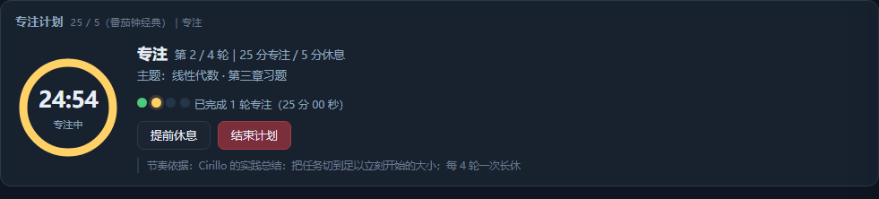
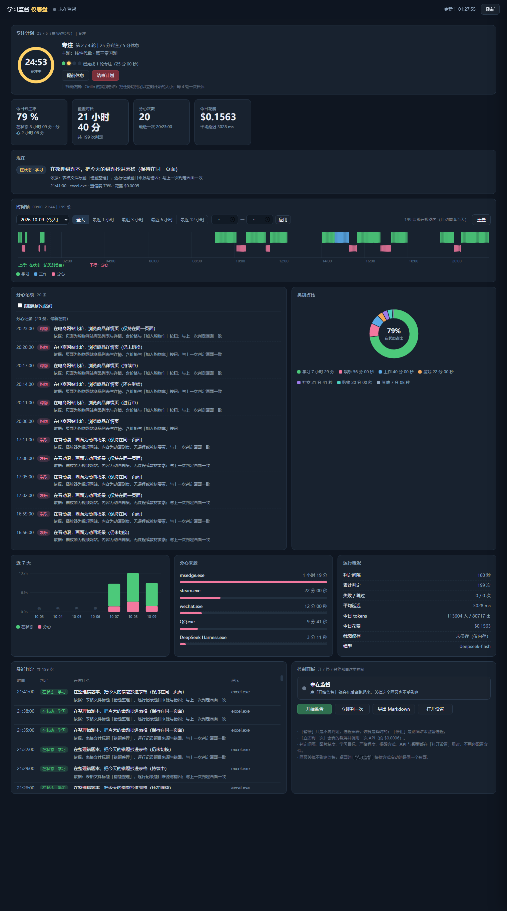
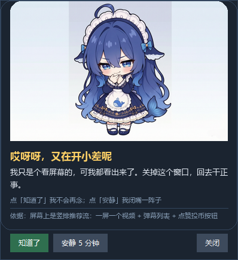
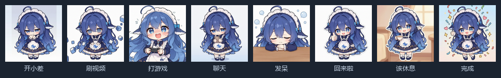

# 学习监督助手（study-watch）

> English version: [README.md](README.md)

> 跟着番茄钟节奏学习，同时让视觉模型盯着你有没有真的在学：每隔几分钟截一张屏判断"你此刻在做什么"，
> 分心就弹窗提醒，并把每次判定记成可复盘的时间轴与日报。**休息时段的判定不计入统计**——
> 老老实实休息不该让你的数据变难看。

判定不是靠窗口标题猜的——**截图会真的送进模型**，所以「标题写着高数课、实际在刷短视频」这种情况也能识别出来。



```
[00:10:23] 截图 1440x900 -> 1440x900 / 167 KB｜前台：msedge.exe
[00:10:25] 在状态｜学习｜在 B 站观看理论力学期末急救课程，画面正讲转动惯量的平行轴定理
[00:10:25]     依据：播放区是课程讲义，"02 转动惯量——平行轴定理"，公式 J_z = J_zc + md²
[00:10:25]     2.5s 内返回｜tokens 684/347｜$0.0006
```

- **番茄钟 / 专注计划**（本项目的重点）：内置 25/5、90/20、52/17、15/3 四种节奏，
  自动切换专注与休息、支持自定义且**记得住你的数值**；休息时段不计入专注率、也不弹分心提醒
- **Windows 桌面工具**，Python 3.10+，唯一第三方依赖是 Pillow
- **不绑定 DeepSeek**：走标准 OpenAI 兼容协议，任何支持图片输入的模型都能用（含本地 llama.cpp / LM Studio）
- **提醒是萌萌的**：八张手绘卡片按场景换表情与台词（吐槽而不是指责），
  夸奖类不受静音影响，判断依据始终跟着一起显示
- **Live2D 桌宠**：鲸鱼娘的表情跟着判定走；可以作为**独立小窗一直陪着**（无边框、置顶、可拖动），
  能直接开始/结束专注计划，也能只当仪表盘里的卡片
- **按前台应用分配截图**：游戏不判定、短视频一切换就查、聊天每 10 分钟、阅读每 5 分钟……省调用也提准确率
- **本地网页仪表盘**：时间轴可缩放与切换日期，启停与全部设置都在网页里改，不用手编配置文件
- 截图默认**只在内存里**编码后发 API，不落盘
- 一键部署脚本会自动检查环境、**缺依赖时自动装**（国内网络自动走镜像）、建好桌面快捷方式

仪表盘长这样（下图用的是演示数据，不是真实记录）：



---

## 目录

- [快速开始](#快速开始)
- [番茄钟与专注计划](#番茄钟与专注计划)
- [提醒：所以它长得萌萌的](#提醒所以它长得萌萌的这是故意的)
- [桌宠：鲸鱼娘跟着你的状态换表情](#桌宠鲸鱼娘跟着你的状态换表情)
- [截图策略：按前台应用分配](#截图策略按前台应用分配)
- [可视化仪表盘](#可视化仪表盘)
- [判断机制](#判断机制)
- [配置](#配置)
- [换别的 API 或本地模型](#换别的-api-或本地模型)
- [成本](#成本)
- [隐私说明](#隐私说明)
- [自测](#自测)
- [已知边界](#已知边界)
- [目录结构](#目录结构)
- [开发笔记](#开发笔记)
- [这个项目是怎么写出来的](#这个项目是怎么写出来的)
- [License](#license)

---

## 快速开始

### 一键部署（推荐）

```powershell
git clone https://github.com/lbgabb/study-watch.git
cd study-watch
powershell -ExecutionPolicy Bypass -File .\setup.ps1
```

`setup.ps1` 会依次：查 Windows → 找 Python → 检查 `PIL`/`tkinter`/`winsound` →
**缺 Pillow 时自动安装**（默认源超时的话自动改走清华/阿里镜像）→ 检查 API key →
缺图标就生成 → 建两个桌面快捷方式 → 跑一次**不花钱**的冒烟测试。

看到 `=== 结果：N 项正常 / 0 项失败 ===` 就成了。

### 手动

```powershell
python -m pip install -r requirements.txt          # 只有 Pillow
$env:DEEPSEEK_API_KEY = "sk-xxxx"                  # 或者在仪表盘「设置」里填
python monitor.py --check-api                      # 先确认模型能用（用内置小图，不截屏）
python monitor.py --minutes 25                     # 监督 25 分钟试试
```

> 装了多个 Python、或想让工具固定用某一个：在项目根目录建 `py-path.txt`，
> 第一行写解释器的完整路径即可（这个文件已在 `.gitignore` 里，不会进版本库）。

### 日常使用

| 入口 | 作用 |
| --- | --- |
| 桌面快捷方式 **学习监督** | 双击静默转入后台开始监督，已在运行则不会重复启动 |
| 桌面快捷方式 **学习监督 仪表盘** | 打开网页仪表盘（`http://127.0.0.1:8770/`） |
| `stop.bat` | 结束后台监督 |
| `report.bat` | 打印今日日报 |

常用命令：

```powershell
python monitor.py --status       # 体检：进程、服务、配置是否生效、今日数据
python monitor.py --policy       # 看当前前台应用会命中哪条截图规则
python monitor.py --check-api    # 用内置小图自检模型连通性（不截你的屏）
python monitor.py --once         # 立刻判一次
python monitor.py --stop         # 停止监督（按命令行识别进程，换机器也能停掉）
python monitor.py --report --days 7
python monitor.py --export       # 导出 Markdown 日报
```

---

## 番茄钟与专注计划

仪表盘顶部的「专注计划」卡片，或命令行 `pomodoro.ps1`。它不只是个计时器——
**计划状态会被写进每次判定记录**，所以事后能看出"这一轮专注质量如何"。


### 内置节奏与各自的依据

| 预设 | 节奏 | 依据（诚实版） |
| --- | --- | --- |
| 25 / 5 | 专注 25 分、休息 5 分，每 4 轮长休 20 分 | Cirillo 的实践总结，把任务切到"足以立刻开始"的大小。**不是实验结论** |
| 90 / 20 | 专注 90 分、休息 20 分 | Kleitman 的 BRAC：清醒时警觉度约 90 分钟一个周期。观察性证据支持这个量级，个体差异很大 |
| 52 / 17 | 专注 52 分、休息 17 分 | DeskTime 2014 年对用户数据的观察性统计。不是对照实验，有"自愿上报"偏差 |
| 15 / 3 | 专注 15 分、休息 3 分 | 状态差、任务难启动时的短冲刺。先用最小代价进入状态 |
| 自定义 | 自己填 | —— |

比具体数字更可靠的是三条共同点：**连续专注有上限；休息要真的离开任务；把时长固定下来能省掉每次"要不要休息"的决策消耗。**
所以挑一个你能坚持的，比挑一个"最科学"的重要。

### 一个刻意的设计：休息不算进专注率

休息时段的判定会被标记为 `exclude_from_stats`，**不计入专注率与类别占比**，而是单独记成"休息时长"。

理由很实际：如果老实休息反而让数据变难看，你下次就不敢休息了——那就本末倒置。
实测对照（休息时刷了 5 分钟手机）：

```
把休息计入统计：专注率 44.4%
排除休息时段　：专注率 100.0%   休息单独记 300s
```

同理，**休息时默认不弹"你分心了"**（可在卡片上勾选打开）。休息就该离开屏幕，
这时候提醒只会让人不敢休息。

### 操作

仪表盘上：选节奏 →（可选）填轮数与主题 → 开始。运行中显示圆环倒计时、轮次进度点，
可以「提前休息」「休息够了，继续」「结束计划」。

**自定义是持久的**：直接改「专注 / 休息 / 每几轮长休 / 长休时长」这几个数字就等于切到自定义节奏，
**改动会自动存进 `config.json` 的 `plan` 段**——关掉浏览器、重启服务后再打开还是你调好的数值，
不用每次重填。几条具体行为：

- 点「自定义」**不会**抹掉你已经调好的数字（只是把它标记成自定义）
- 选中某个预设才会套用该预设的数值
- 开始计划时的取值优先级：**本次请求传的 > 你存下来的 > 预设默认**

```powershell
.\start-25min.bat                                  # 25/5 开一轮
powershell -File .\pomodoro.ps1 -Rounds 4 -Note "高数第三章"
powershell -File .\pomodoro.ps1 -Preset ultradian  # 90/20
powershell -File .\pomodoro.ps1 -Focus 50 -Break 10
powershell -File .\pomodoro.ps1 -Status
powershell -File .\pomodoro.ps1 -Stop
```

计划存在 `data/plan.json`，**重启监督会接着算**，不会从头开始。
`rounds` 填 0 表示不限轮数，做到你手动停。

---

## 提醒：所以它长得萌萌的（这是故意的）

一个冷冰冰的「你分心了」很容易被无视，也更容易被讨厌——然后你就把工具关了。
所以提醒有一张脸，而且它是**吐槽**你，不是指责你。



八张手绘卡片，一种场景一张。表情各不相同，所以还没读字你就能看出这次是因为什么：



| 卡片 | 什么时候出现 | 语气 |
| --- | --- | --- |
| 哎呀呀，又在开小差呢 | 没命中更具体卡片的兜底 | 吐槽 |
| 再刷一个就学习？ | 进程或窗口标题命中短视频站点（抖音、B站、Shorts、Reels…） | 吐槽 |
| 这局不算，那下一局呢 | 类别是游戏 | 吐槽 |
| 回完这条就学习——真的吗 | 类别是社交 | 吐槽 |
| 困了就别硬撑 | 类别是闲置，盯着屏幕什么也没干 | 休息 |
| 这就对了 | 你走神了**又回来了** | 鼓励 |
| 这轮结束了，去休息 | 专注阶段结束、进入休息 | 休息 |
| 计划完成，干得漂亮 | 预定轮数全部做完 | 鼓励 |

几个刻意的选择：

- **吐槽比指责有效。** 「你上一个『再刷一个』是二十分钟前说的」比「你已偏离学习状态」
  管用得多——你会笑一下，然后回去干活。爱说教的工具会被静音掉。
- **夸奖不会被静音。** 正反馈那几张（回来啦／该休息／完成）**不受"安静 N 分钟"影响**。
  否则你永远只听到批评，两天后就不再听了。
- **依据永远跟着一起出现。** 卡片负责开玩笑，下面那行负责说清楚屏幕上到底看到了什么。
  少了它，这就只是个无缘无故骂人的软件。
- **文案里不放 emoji** —— 卡片是系统字体渲染的，emoji 在部分机器上会变成豆腐块。

**同一批头像也复用到仪表盘上**：刚跟你吐槽过的那张脸，就是「现在」面板里那张（64px 带标签），
也是分心明细和最近判定表里那张（各 34px）。不用额外的图，就是同一批文件。

---

## 桌宠：鲸鱼娘跟着你的状态换表情

仪表盘右侧有一只会动的 **Live2D 鲸鱼娘**。它不是装饰——**表情跟着判定结果走**，
一眼就能看出刚才那次判定是什么结论：

| 状态 | 表情 | 它说的话 |
| --- | --- | --- |
| 在状态 | 星星眼 | 在状态，看着挺像样的。 |
| 刚回到正轨 | 流汗 | 刚才还在别处，现在回来了——这就对了。 |
| 通用分心 | 调皮 | 哎呀呀，又在开小差呢。 |
| 刷短视频 | 吐舌 | 再刷一个就学习？你上一个「再刷一个」是二十分钟前说的。 |
| 打游戏 | 生气 | 这局不算，那下一局呢。存档不会跑，作业会。 |
| 发呆/闲置 | 呆呆眼 | 盯着屏幕发呆不算学习，也不算休息。 |
| 犯困 | 闭眼口水 | 困了就别硬撑，起身走两步。 |
| 该休息了 | 爱心眼 | 这轮结束了，去休息。 |
| 计划完成 | 开心兴奋 | 计划完成，干得漂亮。 |
| 连续多次分心 | 哭 + 喷水动作 | 连续好几次了。要不要先休息一下？ |

点它一下会有反应（吹泡泡动作）。

### 三种形态，按场合用

| 形态 | 打开方式 | 特点 |
| --- | --- | --- |
| **独立窗口** | 双击 `pet.bat`，或控制面板点「打开独立桌宠」 | 无边框、置顶、可拖动，一直陪着你；关掉它不影响监督与统计 |
| 仪表盘里的卡片 | 打开仪表盘就能看到 | 看数据时顺带看到它 |
| 提醒弹窗 | 分心时自动弹出 | tkinter 静态卡片，零依赖、秒开 |

三种形态用的是**同一个模型、同一套判断规则**，所以表情始终一致。

独立窗口可以调尺寸与位置（`pet.ps1 -Width 420 -Height 520 -X 100 -Y 80`），
默认 380x480。它**自己会保证服务在跑**，所以只开桌宠不开仪表盘也能用。

### 它也是计划与提醒的落点

桌宠不只是装饰，**专注计划和分心提醒都会走到它这里**：

| 集成点 | 表现 |
| --- | --- |
| **专注计划** | 气泡里显示倒计时与轮次：专注中 24:51｜第 1 轮 — 我盯着呢；休息时变成 休息中 04:32｜第 1 轮 — 离开屏幕走两步吧 |
| **分心提醒** | 提醒窗弹出的**同时**，它换表情并说出同一件事：气泡显示屏幕上看到的原文，标签显示场景（游戏 · 20:11）。两者共用同一套判断，不会一个说游戏一个说娱乐 |
| **阶段切换 / 计划完成** | 进入休息播端茶动作，完成播庆祝动作 |

**桌宠这边也能直接操作计划**，不必再开仪表盘：

| 计划状态 | 桌宠窗口里的按钮 |
| --- | --- |
| 未在跑 | 「开始专注」 |
| 专注中 | 「提前休息」「结束计划」+ 右侧倒计时 |
| 休息中 | 「结束休息，继续」「结束计划」 |

控制面板里的**番茄钟卡片也照旧保留**——同一份计划的另一个入口，不是把它搬走：
想改节奏、看完整进度用卡片，想一边学一边看倒计时就用桌宠。

### 开关与调参

设置抽屉里有专门的「桌宠」一组，**觉得占资源就关掉**：

| 设置 | 默认 | 说明 |
| --- | --- | --- |
| 启用 Live2D 桌宠 | 开 | 关掉后刷新页面：不再加载 3.9 MB 模型与渲染库，页面回到纯图表 |
| 帧率上限 | 20 | Live2D 的呼吸眨眼在 20fps 下看不出差别，调高更顺滑但更吃 CPU |
| 在气泡里显示专注计划 | 开 | 关掉后气泡不再显示倒计时 |
| 让桌宠说出提醒内容 | 开 | 关掉后只换表情，不说话 |
| 切到后台时暂停渲染 | 开 | 标签页不可见时停掉模型更新 |

改完**刷新页面**生效（模型只在页面加载时读一次配置）。

**没有 WebGL 或素材缺失时它只是不显示，不会影响仪表盘其他功能**——桌宠是锦上添花，不该拖累主功能。

### 为什么桌宠在浏览器里，而不是提醒弹窗里

提醒弹窗是 `tkinter` 写的，**tkinter 没有 WebGL**，而 Live2D 必须有 WebGL 才能渲染。
要在弹窗里放 Live2D，只能常驻一个浏览器进程、按帧截图喂给 tkinter（CPU 代价大），
或者换成 Electron/WebView2（体积从几 MB 涨到 150MB+）。两个都不划算。

所以职责这样分：

- **提醒弹窗**（tkinter）：静态卡片，零依赖、秒开、不占资源
- **桌宠**（仪表盘）：Live2D 实时渲染，因为浏览器本来就在跑，**不新增任何常驻进程**

### 它是独立窗口（不只是仪表盘里的卡片）

桌宠有两种形态，都不需要额外装东西：

| 形态 | 打开方式 | 特点 |
| --- | --- | --- |
| **独立窗口** | 双击 `pet.bat`，或控制面板点「打开独立桌宠」 | 无边框、置顶、可拖动，一直陪着你；关掉它不影响监督与统计 |
| 仪表盘里的卡片 | 打开仪表盘就能看到 | 看数据时顺带看到它 |

两种形态用**同一个模型、同一套判断规则**，所以表情始终一致。

> 为什么独立窗口用浏览器而不是原生窗口？一句话：**Live2D 需要 WebGL，
> 而 tkinter 没有**。当时把「预渲染帧 + Python 播放」这条路完整量过
> （含逐像素透明窗口的做法与全部性能数字），结论是可行但不划算 ——
> 权衡与实测数据见 [docs/pet-render-choice.md](docs/pet-render-choice.md)。

### 素材与许可（重要）

角色素材是 **[CC BY-NC-SA 4.0](https://creativecommons.org/licenses/by-nc-sa/4.0/deed.zh)（非商业）**，
跟本项目的 MIT **不是一回事**。分层声明见 [NOTICE.md](NOTICE.md) 与 [PROVENANCE.md](PROVENANCE.md)。

**角色形象是三重版权，署名缺一不可：**

| 版权所有人 | 贡献 |
| --- | --- |
| **上善无形** | 鲸鱼娘角色形象原作，原创 OC「溟月」 |
| **ZipZipPipe** | 加入 DeepSeek 元素的「女仆鲸鱼娘」二次设计 |
| **氵六青**（B站 UID 11272072） | Live2D 化：绑定、动作、表情 |

**本项目免费、无广告、不带货 → 属于非商业使用，可以用。**
但如果你想拿它收费或接广告，**必须先删掉 `assets/live2d/` 与 `assets/reminder/`**。

Live2D Cubism Core 是 Live2D Inc. 的专有运行时（允许随作品再分发），
pixi 与 pixi-live2d-display 是 MIT。

---

## 截图策略：按前台应用分配

同一套间隔用在所有程序上是浪费——看视频、聊天、写代码的"变化速度"完全不同。规则写在 `config.json` 的 `capture.rules`，**按书写顺序，第一条命中者生效**：

```jsonc
{
  "interval_sec": 120,  // 判定间隔（秒）
  "min_gap_sec": 30,
  "max_width": 1600,  // 截图缩放宽度，越小越省
  "jpeg_quality": 85,
  "detail": "low",  // 图片精度：low 更省，high 能看清小字
  "idle_skip_sec": 300,  // 超过这么久没键鼠输入就跳过
  "capture": {  // 见上文「截图策略」
    "enabled": true,
    "default_sec": null,
    "min_gap_sec": 20,
    "rules": []
  },
  "plan": {  // 番茄钟默认值；在仪表盘里调过就记在这里
    "preset": "pomodoro",  // 上次用的节奏
    "focus_min": 25,
    "break_min": 5,
    "long_every": 4,
    "long_break_min": 20,
    "rounds": 0,  // 0 = 不限轮数
    "remind_on_break": false,  // 休息时是否也提醒分心（默认关）
    "strict_break": false,  // 休息是否计入统计（默认关）
    "start_monitor": true  // 点「开始专注」时是否连带启动监督
  },
  "api": {  // 走标准 OpenAI 兼容协议，任何支持图片输入的模型都行
    "base_url": "https://api.deepseek.com",
    "model": "deepseek-flash",
    "api_key_env": "DEEPSEEK_API_KEY",  // 去这个环境变量里找 key
    "credentials_file": "~/.study-watch/credentials.yaml",  // 没有环境变量时，从这个 yaml 里读
    "temperature": 0,
    "max_tokens": 900,
    "timeout_sec": 90
  },
  "judge": {  // 判定标准
    "goal": "学习（课程、教材、网课、题库、编程、外语、写作业与笔记）",
    "strictness": "normal",  // loose 宽松 / normal / strict 严格
    "extra_rules": [],  // 额外规则，例如「看论文算学习」
    "alias_rules": []  // 归类约定，例如把某程序固定算作学习
  },
  "reminder": {  // 提醒方式
    "enabled": true,
    "backend": "auto",
    "sound": true,
    "mute_after_remind_sec": 300,  // 提醒一次后安静多久
    "off_task_streak_required": 1,  // 改成 2 就是「连续 2 次分心才提醒」
    "auto_close_sec": 60  // 提醒窗自动关闭（0 = 不自动关）
  },
  "privacy": {  // 隐私开关
    "save_shots": false,  // true 会把截图存到 data/shots
    "save_api_raw": true,  // 存模型原始回复，方便排查误判
    "shots_dir": "data/shots"
  },
  "pet": {  // Live2D 桌宠（住在仪表盘 / 独立窗口里）
    "enabled": true,  // 关掉后刷新页面即不再加载 3.9MB 模型与渲染库
    "max_fps": 20,  // 帧率上限；呼吸眨眼在 20fps 下看不出差别
    "show_plan": true,  // 气泡里是否显示专注计划倒计时
    "speak": true,  // 是否把提醒内容说进气泡
    "pause_when_hidden": true  // 标签页不可见时停掉渲染
  }
}
```

| 字段 | 作用 |
| --- | --- |
| `process` / `process_contains` | 按进程名匹配，支持 `*` 通配 |
| `title` / `title_contains` | 按窗口标题匹配（与进程命中任一即可） |
| `action: "skip"` | 该应用**不判定**：不截图、不调 API、不计入统计 |
| `tick_sec: N` | 距上次判定满 N 秒才查 |
| `polling_sec: N` | 切到该应用先查一次，之后每 N 秒一次 |
| `switch_check: true` | 窗口一切换到该应用就立刻查 |

没命中任何规则的程序走全局 `interval_sec`——**不配规则时行为和朴素版本完全一样**。

跳过的原因会写进日志，每次监督结束也会汇总：

```
该应用不判定：notepad（规则：记事本不判定），本轮不截图
本次监督结束：运行 40秒｜判定 0 次｜按应用策略省下 4 次判定｜花费 $0.0000
```

状态存在 `data/state.json`，**跨重启续上**，所以重启监督不会连打好几次。

---

## 可视化仪表盘

浏览器打开 `http://127.0.0.1:8770/`（端口被占会自动往后找）。

| 区域 | 内容 |
| --- | --- |
| 概览卡 | 当天专注率、覆盖时长、分心次数、花费 |
| **现在 / 当天最后一条** | 最近一次判定的"在做什么" + 判断依据（屏幕上看到的原文） |
| **时间轴** | 按类别着色的横条，上行=在状态、下行=分心，**条长就是真实时长**；可缩放、可选日期 |
| **分心记录明细** | 什么时候分心的、当时在做什么、依据是什么；可跟随时间轴区间 |
| 类别占比 / 近 7 天 / 分心来源 / 运行概况 | 环形图、堆叠柱状图、按程序排名、token 与成本 |
| **控制面板** | 开始 / 暂停 / 停止 / 立即判一次 / 导出 / 打开设置 |

### 时间轴：缩放与自定义区间

时间轴默认铺满当天，想细看某一段有四种操作：

| 操作 | 效果 |
| --- | --- |
| **日期下拉**（左上） | 切换要看的日期（列出所有有记录的日子）；`?day=2026-10-08` 也能直接打开某天，可收藏 |
| **预设按钮** | 全天 / 最近 1·3·6·12 小时。看今天时以"现在"为锚点，看历史日期时以**那天末尾**为锚点 |
| **自定义区间** | 填起止时间（HH:MM）后点「应用」；起 > 止时自动按跨零点处理（如 22:00 → 02:00） |
| **在时间轴上拖选** | 直接框住一段就缩放过去；**滚轮**以光标位置为中心缩放 |
| 重置 | 回到全天视图 |

细节：

- 刻度间隔**自适应**：全天时按小时，放大到小时以内会自动变成 10 分钟、5 分钟
- 只看今天时会画一条"现在"的虚线做参照
- 标题实时显示当前窗口与段数，例如 `23:35–00:01｜12 段`
- 「分心记录」可以勾选**跟随时间轴区间**，只看这段时间里的分心
- 看历史日期时，顶部会标明"当天最后一条 YYYY-MM-DD（历史）"，概览卡也换成那天的数字（近 7 天图始终按当前情况显示）

### 控制面板的三种状态

| 状态 | 含义 | 可做的操作 |
| --- | --- | --- |
| 未在监督 | 没有监督进程 | 开始监督 |
| 监督中 | 每 N 秒截屏判定一次 | 暂停判定、停止监督、立即判一次、导出、打开设置 |
| 已暂停 | 进程还在待命，**不截图、不花钱**，恢复是瞬时的 | 继续监督、停止监督、打开设置 |

「暂停」只是不再判定，进程留着；「停止」是彻底结束监督进程。
服务会**尊重你的意图**：点过停止之后，即使监控进程被外部杀掉，也不会被状态刷新偷偷拉回来。

### 设置都在控制面板里

控制面板的「打开设置」滑出抽屉，**不用手编 config.json**：

| 分组 | 能改什么 | 生效时机 |
| --- | --- | --- |
| API key | 查看现状（只显示掩码 + 来源），填新的并保存 | 立即 |
| 判定节奏 | 判定间隔、空闲跳过阈值、最小间隔、全局间隔覆盖 | 下一轮判定 |
| 截屏与图片 | 图片精度、JPEG 质量、缩放宽度、是否落盘、是否存原始回复 | 多数下一轮 |
| 判定标准 | 学习目标、严格程度、额外规则、归类约定 | 下一轮判定 |
| 提醒 | 开关、提示音、安静时长、连续几次才提醒、自动关闭 | 下一轮判定 |
| API / 模型 | base_url、模型名、key 环境变量名、凭据文件、超时、max_tokens、temperature | **需重启监督** |

每个字段旁有徽章标明「下一轮生效」还是「需重启」——监控进程**每一轮都重读配置文件**，所以大部分设置改完下个周期就生效，不必重启。

- **测试 API 连通**：用一张内置小图（**不截你的屏**）验证 base_url / 模型 / key，不落盘
- **保存**：只写 `config.json`；有非法值时**整批拒绝**并说明原因
- key 存到 `data/secrets.json`（不进版本库）。优先级：环境变量 > 面板保存 > 凭据文件
- 想直接打开设置页：`http://127.0.0.1:8770/?settings=1`

---

## 判断机制

一轮的完整流程：

```
循环开始
 ├─ 重读配置（面板改的设置从这里生效）
 ├─ 检查 data/paused        → 暂停中：本轮不做任何事
 ├─ 检查是否锁屏 / 空闲过长  → 是：跳过本轮（不截图、不花钱、不计入统计）
 ├─ 按前台应用决定要不要截图 → 策略说不查：跳过
 ├─ 截图（整个虚拟桌面）→ 缩放 → JPEG → base64
 ├─ 连"前台程序名 + 窗口标题"发给视觉模型
 ├─ 解析 JSON 判定 → 写日志 → 分心则弹提醒
 └─ 睡满 interval_sec → 回到循环开始
```

模型被要求只回一个 JSON：

```json
{"activity":"一句话描述此刻在做什么","category":"学习|工作|娱乐|社交|游戏|购物|闲置|其他",
 "on_task":true,"confidence":0.86,"basis":"引用屏幕上实际看到的具体文字或界面元素"}
```

提示词里写死了几条关键规则（可在设置里改）：

- **以画面为准**，窗口标题只是线索，防止"标题像学习、内容是短视频"漏判
- 短视频/推荐流形态（一屏一视频、弹幕、点赞投币）**即使内容是知识科普也算娱乐**
- 课程视频、教材 PDF、题库、写代码、背单词、记笔记算学习
- 锁屏 / 纯桌面 / 看不出在用电脑算"闲置"

模型偶尔会吐出不合法 JSON，此时会**宽容修补**（漏转义引号、缺/多逗号、夹带解释文字），仍失败就带上"必须输出合法 JSON"的提示重发一次。

截屏开销（2880×1800 屏实测）：抓屏 ~98ms + 缩放 ~80ms + 编码 ~15ms ≈ **193ms**，JPEG 约 150KB。

---

## 配置

配置文件 `config.json`（也可以在仪表盘里改）：

```jsonc
{
  "interval_sec": 180,        // 判定间隔（秒）
  "idle_skip_sec": 300,       // 超过这么久没键鼠输入就跳过
  "max_width": 1600,          // 截图缩放宽度，越小越省
  "detail": "low",            // 图片精度：low 更省，high 能看清小字
  "capture": { /* 见上文"截图策略" */ },
  "plan": {                   // 番茄钟默认值，在仪表盘里调过就记在这里
    "preset": "pomodoro", "focus_min": 25, "break_min": 5,
    "long_every": 4, "long_break_min": 20, "rounds": 0,
    "remind_on_break": false, // 休息时是否也提醒分心（默认关）
    "strict_break": false,    // 休息是否计入统计（默认关）
    "start_monitor": true     // 点「开始专注」时是否连带启动监督
}
  "pet": {                    // Live2D 桌宠（住在仪表盘 / 独立窗口里）
    "enabled": true,          // 关掉后刷新页面即不再加载 3.9MB 模型与渲染库
    "max_fps": 20,            // 帧率上限；呼吸眨眼在 20fps 下看不出差别
    "show_plan": true,        // 气泡里是否显示专注计划倒计时
    "speak": true,            // 是否把提醒内容说出来
    "pause_when_hidden": true // 标签页不可见时停掉渲染
}
  "api": {
    "base_url": "https://api.deepseek.com",
    "model": "deepseek-flash",
    "api_key_env": "DEEPSEEK_API_KEY",       // 去这个环境变量里找 key
    "credentials_file": "~/.study-watch/credentials.yaml"
                                             // 没有环境变量时，从这个 yaml 里读
                                             // 形如：DEEPSEEK_API_KEY: sk-xxxx
}
  "judge": {
    "goal": "备考学习（课程视频、教材、网课、题库、编程/外语学习、写作业与笔记）",
    "strictness": "normal",   // loose 宽松 / normal / strict 严格
    "extra_rules": [],
    "alias_rules": []
}
  "reminder": {
    "enabled": true, "sound": true,
    "mute_after_remind_sec": 300,
    "off_task_streak_required": 1,   // 改成 2 就是"连续 2 次分心才提醒"
    "auto_close_sec": 60
}
  "privacy": {
    "save_shots": false,      // true 会把截图存到 data/shots
    "save_api_raw": true      // 存模型原始回复，方便排查误判
}
}
```

环境变量可临时覆盖：`STUDY_WATCH_INTERVAL`、`STUDY_WATCH_MODEL`、`STUDY_WATCH_BASE_URL`、`DEEPSEEK_API_KEY`。

---

## 换别的 API 或本地模型

用的是**标准 OpenAI 兼容协议**（`POST {base_url}/chat/completions`，Bearer 鉴权，图片走 `image_url` 的 base64 data URL），不是某家的私有接口。**唯一要求是模型支持图片输入。**

```powershell
# 例：换成通义千问兼容模式（不用改配置文件）
$env:STUDY_WATCH_BASE_URL = "https://dashscope.aliyuncs.com/compatible-mode/v1"
$env:STUDY_WATCH_MODEL    = "qwen-vl-max"
$env:DASHSCOPE_API_KEY    = "sk-xxxx"
python monitor.py --check-api
```

> `base_url` 要不要带 `/v1`：代码统一拼 `{base_url}/chat/completions`。OpenRouter、SiliconFlow、通义兼容模式这类要写 `/v1`；`https://api.deepseek.com` 这类不用。拿不准就试一次——404 就是路径不对。

**本地模型**（零 API 费用、截图不出本机）：llama.cpp 或 LM Studio 起了 OpenAI 兼容服务后，`base_url` 填 `http://127.0.0.1:1234/v1`，key 随便填个非空值。

不同服务商对协议的支持程度不一样，代码里做了**逐级降级**（对上层透明）：

| 情况 | 处理 |
| --- | --- |
| 不认 `image_url.detail`（llama.cpp / LM Studio / 部分网关） | 自动去掉该字段重发 |
| 不支持 `response_format: json_object` | 自动去掉它重发，靠宽容 JSON 解析兜底 |
| 正文放在 `content` 数组里 | 自动拼接取文本 |
| 鉴权失败 / 模型不存在 / 被限流 | **不重试**，直接给出可操作提示（含当前 base_url 与 model） |

---

## 成本

以 `deepseek-flash` 为例，每次判定约 **$0.0006~0.0010**（图 400~700 输入 token + 300~600 输出）：

| 频率 | 每天 4 小时 | 每月（22 天） |
| --- | --- | --- |
| 2 分钟一次 | 120 次 ≈ $0.10 | ≈ $2.2 |
| 3 分钟一次（默认） | 80 次 ≈ $0.07 | ≈ $1.5 |
| 5 分钟一次 | 48 次 ≈ $0.04 | ≈ $0.9 |

配上截图策略后实际更低：游戏时段完全不查，聊天/阅读时段降频，只有短视频这类高风险场景才提高频率。

省钱手段：调大间隔、把 `max_width` 降到 1280、`detail` 保持 `low`、用截图策略把无关程序排除掉。

---

## 隐私说明

- 截图**只在内存里**编码后直接发给你配置的 API，默认**不落盘**（`save_shots: false`）
- 落盘的是文本判定结果（在做什么、依据里引用的屏幕文字）——依据可能包含屏幕上的原文片段。介意的话关掉 `save_api_raw`，或定期清理 `data/`
- `data/` 整个目录已在 `.gitignore` 里，包含日志、判定记录、原始回复、以及面板里填的 key（`data/secrets.json`）
- 仪表盘只监听 `127.0.0.1`，不对外暴露
- 想让它别看某个应用（密码管理器、私密聊天），在 `capture.rules` 里给它 `"action": "skip"`

---

## 自测

```powershell
.\selftest.bat        # 一键跑全部 20 项，最后给出汇总
```

| 测试 | 验证什么 |
| --- | --- |
| `tests/test_json_repair.py` | 模型吐出畸形 JSON（漏转义引号、缺逗号、多余逗号、夹带解释文字）能否修补回可解析 |
| `tests/test_provider_compat.py` | 服务商兼容性：标准 / 不认 detail / 不支持 JSON 模式的降级链；鉴权与 404 不重试且提示可操作 |
| `tests/test_policy.py` | 截图策略：规则匹配、skip/tick/polling/switch 四种语义、兜底闸门、关闭策略时的回退 |
| `tests/test_report.py` | 日报聚合与时长折算（含分心、错误、跳过三类记录） |
| `tests/test_popup_shot.py` | 提醒窗是否真的渲染出标题/正文/按钮文字（PrintWindow 抓窗口内容做结构判定） |
| `tests/test_server.py` | 仪表盘服务能否启动、API 字段是否齐全、时间轴/类别时长是否自洽、启停控制是否生效 |
| `tests/test_config_api.py` | 设置读写：白名单、类型/取值校验、非法输入整批拒绝、key 只回掩码、跑完配置逐字节还原 |
| `tests/control_flow.py` | 控制面板流程：开 → 暂停 → 恢复 → 停止，以及"没在跑时点暂停会自动拉起" |
| `tests/test_recovery.py` | 服务韧性：监控进程被强杀后，用户主动操作能把监控接回来 |
| `tests/test_intent.py` | 用户意图：点过停止之后，反复刷新状态也不会把监控偷偷拉起来 |
| `tests/test_readonly_status.py` | 状态接口只读性：连打 40 次轮询，进程数/标记/state.json 零变化 |
| `tests/test_cross_process_lock.py` | 跨进程启动互斥：多个独立进程并发启动只起一个监控 |
| `tests/test_plan.py` | 番茄钟：阶段推进、长休规则、轮次上限、跨重启续上，以及**休息不计入专注率**；界面部分用无头浏览器实点 |
| `tests/test_pet_integration.py` | 桌宠集成：计划倒计时出现在气泡里、提醒事件会换表情并说同一句话（且反应期内不被覆盖）、关掉后确实不再加载模型 |
| `tests/test_pet_window_integration.py` | 独立桌宠窗口：提醒事件换成表情并说同一句话、气泡显示计划倒计时、**在窗口里点按钮能真的开始/结束计划** |
| `tools/cdp_check.py` | **仪表盘界面交互**（无头 Edge + CDP 实测）：时间轴预设/自定义区间/拖选缩放、提示不被自动重绘冲掉、日期切换与历史标注 |
| `monitor.py --dry-run` | 截图与前台窗口采集链路是否正常（不调用 API、不花钱） |

`tests/test_plan_loop.py` 是**耗时的联动实测**（约 3 分钟，要真的等过一个阶段），
所以没放进一键自测：它起一个 1 分钟一轮的计划和后台监控，验证监控进程会自己推进阶段、
把切换写进日志、并给休息时段的记录打上"不计入统计"的标记。改了番茄钟与监控循环的接口后值得跑一次：

```powershell
python tests\test_plan_loop.py
```

另外 `tools/` 下有排障与生成工具：

| 工具 | 作用 |
| --- | --- |
| `tools/status.py` | 一次打印进程、今日汇总、日志尾部 |
| `tools/list_procs.py` | 列出服务/监控进程及启动时间（排查重复进程） |
| `tools/ensure_running.ps1` | 命令行把服务与监督都拉起来（排障用） |
| `tools/measure_capture.py` | 实测截屏各阶段耗时与体积 |
| `tools/show_settings.py` | 打印当前生效的设置 |
| `tools/net_*.py` | 网络诊断：延迟/丢包、真实下载吞吐、CDN 节点对比、可选清晰度 |
| `tools/cdp_check.py` | 无头浏览器实测仪表盘交互（时间轴、日期切换、提示是否被重绘冲掉） |
| `tools/cdp_eval.py` | 在真实页面里执行 JS 并打印结果（前端排障用） |
| `tools/hunt_flaky.py` | 反复跑自测直到复现偶发失败，并把上下文留档 |
| `tools/repo_audit.py` | 发布前审计：扫描密钥、个人路径、不该提交的运行数据 |
| `tools/pack_source.py` / `pack_friend.py` | 打包源码包 / 给朋友的运行包 |
| `tools/make_github_upload.py` | 生成可直接拖到 GitHub 网页上传的目录 |
| `tools/make_readme_shots.py` | 自动给 README 拍配图（起一个真实计划 + 截卡片与整页） |
| `tools/make_demo_data.py` | 生成**零隐私**的演示数据（截图用），`--clean` 一键清掉 |
| `tools/check_pet_window.py` | 体检独立桌宠窗口（走 CDP，不是 PrintWindow —— 后者抓不到 WebGL 内容） |
| `tools/measure_live2d_cost.py` | 实测桌宠的 CPU/内存开销（与"停用桌宠"对照） |
| `tools/live2d_check.py` | 验证入库后的模型可加载、动作与表情都已注册 |
| `tools/build_live2d_model.py` | 从原始模型包生成带动作/表情注册的 model3.json |
| `tools/fetch_cubism_core.py` | 取回 Live2D Cubism Core 运行时（校验版本与许可头） |
| `tools/make_shortcut*.ps1` | 重建桌面快捷方式 |
| `tools/fix_script_encoding.py` | 修正脚本编码（见下方开发笔记） |
| 	ools/check_readme.py | 中英两版 README：加粗标记成对（允许跨行）、表格列数一致、代码块闭合、目录锚点全部可跳转 |
| `tools/check_readme_config.py` | README 里的配置示例是否与 lib/config.py 的默认值完全一致（44 个键），以及去掉注释后是不是合法 JSON |

---

## 已知边界

- **只在 Windows 上跑**：依赖 `user32`/`gdi32`/`shcore`/`ntdll`（ctypes）、`tkinter`、`winsound`
- **全屏独占的游戏**可能截不到内容，会落到"闲置/其他"
- **判定会误判**：觉得太严就用 `strictness: "loose"`，或把 `off_task_streak_required` 改成 2；觉得太松就 `strict` 并加 `extra_rules`
- 它只提醒，**不锁屏、不阻止你打开任何程序**
- 换机器可用（无硬编码路径），但需要装 Python 3.10+ 与 Pillow。脚本找 Python 的顺序是：
  项目根目录的 `py-path.txt`（自建，已 gitignore）→ 常见安装位置（**优先挑已装 Pillow 的那个**）→ PATH。
  一台机器上装了两个 Python 时，没依赖的那个会被自动跳过
- 想跨平台需要重写 `lib/winapi.py`（窗口/空闲/锁屏/DPI）、`lib/notify.py`（提醒窗）、以及 `vision.py` 里的抓屏方式；策略层、数据层、模型层、界面都是平台无关的

---

## 目录结构

```
study-watch/
├─ monitor.py               入口（等价 python -m lib.monitor）
├─ config.json              配置（也可在仪表盘里改）
├─ setup.ps1                一键部署：查环境、建快捷方式、冒烟测试
├─ selftest.ps1 / .bat      一键自测（20 项）
├─ study-watch.cmd          桌面「学习监督」快捷方式的目标（纯 ASCII 外壳）
├─ dashboard.bat / .ps1     桌面「学习监督 仪表盘」快捷方式的目标
├─ start.ps1 / .bat         控制台模式运行
├─ pomodoro.ps1             番茄钟命令行入口（预设/自定义/状态/停止）
├─ pet.bat / pet.ps1        独立桌宠窗口的入口（双击即开）
├─ start-25min.bat          双击开一轮 25/5，结束后自动出日报
├─ report.bat / stop.bat    看日报 / 结束后台监督
├─ requirements.txt         只有 Pillow
├─ LICENSE                  MIT
├─ assets/
│  ├─ live2d/               Live2D 模型（moc3 + 贴图 + 8 动作 + 15 表情）3.9 MB
│  ├─ vendor/               渲染运行时：Cubism Core（专有）/ pixi / pixi-live2d-display
│  ├─ reminder/             提醒卡片（中英各 8 张）+ 仪表盘用的圆形头像
│  ├─ study-watch.ico       多尺寸图标（16~256，BMP/DIB 帧）
│  ├─ icon-preview.png      各尺寸预览
│  └─ dashboard-preview.png README 用的界面截图
├─ lib/
│  ├─ monitor.py            主循环与 CLI
│  ├─ config.py             配置加载与合并
│  ├─ vision.py             截图编码、调用模型、JSON 解析与修补、key 解析
│  ├─ policy.py             截图策略：按前台应用决定这一轮要不要截图
│  ├─ plan.py               番茄钟状态机（阶段推进 / 长休规则 / 跨重启续上）
│  ├─ winapi.py             前台窗口 / 空闲 / 锁屏 / DPI（纯 ctypes）
│  ├─ proc.py               进程命令行查询（纯 ctypes 读 PEB）
│  ├─ notify.py             置顶提醒窗 + 提示音 + 系统通知回退
│  ├─ store.py / report.py  日志读写与日报聚合
│  ├─ state.py              跨重启状态（上次判定时间 / 上次前台应用）
│  ├─ server.py             仪表盘后端（纯标准库 HTTP + API + 启停控制）
│  ├─ pet_window.py        独立桌宠窗口（浏览器 app 模式 + 开关 + 进程管理）
│  ├─ pet_event.py         监控进程写给桌宠的事件信箱（提醒 / 阶段切换）
│  ├─ avatars.py           每条判定该显示哪个头像（按前一条判断是否刚回来）
│  ├─ reminder_copy.py     提醒文案与配图映射（中英双语）
│  ├─ icon.py               图标绘制与 .ico 生成
│  └─ common.ps1            PowerShell 侧公共函数
├─ web/
│  ├─ index.html            仪表盘页面（深色主题，无外部依赖）
│  ├─ app.js                仪表盘前端：时间轴 / 环形图 / 柱状图 / 明细 / 控制 / 设置
│  ├─ pet.html              独立桌宠窗口的页面（无边框、只有角色与控制条）
│  └─ pet.js                桌宠前端：表情切换 / 气泡 / 计划控制条 / 互动
├─ docs/
│  └─ pet-render-choice.md  为什么桌宠用浏览器窗口（含"预渲染帧"方案的实测与取舍）
├─ tests/                   20 项自测
└─ tools/                   排障与生成工具
```

---

## 开发笔记

几个踩过的坑，改代码前值得看一眼。

### 脚本编码（最容易踩）

- **`.ps1` 必须存成 UTF-8 with BOM**：PowerShell 5.1 靠 BOM 才认 UTF-8，否则中文注释会被按 GBK 拆字节，连引号配对都被破坏、直接语法报错
- **`.cmd` / `.bat` 必须不能有 BOM**：cmd.exe 在 `chcp` 之前就按 ANSI 读文件，行首 BOM 会让 `@echo off` 失效
- **批处理里不要写中文**：中文字节里可能含 `0x5C`（反斜杠），cmd 会把它当转义而报错。UI 文案一律交给 `.ps1`

**这个坑踩过两次**：用普通文本编辑工具（或脚本里的 `write_text(encoding="utf-8")`）改 `.ps1` 时，
BOM 会被悄悄丢掉，下次运行时 PowerShell 直接语法报错，而报错信息是一堆看不懂的乱码。
所以 `python tools/fix_script_encoding.py` 加了 `--check` 模式，并且**作为自测的第一项**——
改完不用记得跑，跑自测就会告诉你。修正：

```powershell
python tools\fix_script_encoding.py          # 自动修正
python tools\fix_script_encoding.py --check  # 只检查（有问题返回 1）
```

### 图标

`.ico` 用了 BMP/DIB 帧而不是 PNG 帧。PNG 帧在规范允许，但部分 Shell 渲染路径会显示成白纸。重新生成：`python -m lib.icon`。

### 状态接口必须只读

页面每 5 秒轮询 `/api/data`。任何"顺手在这里自愈一下"的改动都会让**停止按钮失效**（点完几秒又被拉起来）。`tests/test_readonly_status.py` 专门守这条不变量。

### 启动要跨进程互斥

"用户点开始"和"服务自愈"是两个独立进程，靠文件锁（`data/start.lock`）串行化，否则会起出两个监控进程——重复判定、重复扣费、提醒弹两次。`tests/test_cross_process_lock.py` 守这条。

### 找 Python：要挑"能用"的那个

一台机器上装两个 Python 很常见（系统一个、便携版一个）。只按路径排序会挑到**没装 Pillow 的那个**，
工具直接跑不起来。所以 `Resolve-Python` 的顺序是：

1. 项目根的 `py-path.txt`（用户显式指定，最高优先）
2. 常见安装位置，**先用 `import PIL` 试一遍，优先挑能用的**，其次才比版本号
3. PATH 里的 `python`

另外脚本里**不要出现指向作者机器的路径**——那是换台机器就失效的隐形炸弹。

### 缺依赖要能自己救回来

`setup.ps1` 检查依赖时有个坑：`$ErrorActionPreference = 'Stop'` 会把子进程写到 stderr 的
`ImportError` traceback 当成终止错误，脚本直接崩掉——**而这恰恰是新用户最常遇到的情况**。
检查前要临时放宽成 `Continue`。

真缺 Pillow 时自动安装，并且**默认源超时后自动换清华/阿里镜像**：国内直连 PyPI 经常卡死，
这一步决定了新用户能不能顺利装上。

### Git 换行符与 .ico

Windows 上 `core.autocrlf = true` 很常见。项目根**必须有 `.gitattributes`** 明确声明：

```
*.cmd  text eol=crlf      # 批处理必须是 CRLF
*.ico  binary             # 否则会被当文本做换行转换，图标直接损坏
*.png  binary
```

自测办法：`git hash-object --path assets/study-watch.ico` 与 `--no-filters` 的结果必须一致
（本项目实测 381038 字节逐字节相同）。

### 前端改动要用真实浏览器验

缩放、拖选这类交互**截图证明不了什么**（看不出"点了按钮之后状态对不对"）。而 Edge 新版无头的
`--dump-dom` 不输出内容。解法是用 CDP（Chrome DevTools 协议）真的去点、去读 DOM：
`tools/cdp_check.py` 就是为此写的，**纯标准库**实现了 WebSocket，不装任何包。
它挂在自测第 8 项，改动前端后跑一次就知道有没有弄坏交互。

### 校验提示会被自动重绘冲掉

页面每 5 秒重绘一次。任何"直接写 DOM 就完事"的提示（比如输入非法时的警告）都会在 5 秒内消失，
用户根本看不到。提示状态要存下来，让重绘时优先显示它。

### 给 README 截图别用真实数据

一开始我直接截真实仪表盘，结果图里带上了聊天对象昵称、浏览记录、正在做的事——
这些会跟着 README 一起进公开仓库。所以改成用 `tools/make_demo_data.py` 生成演示数据：

```powershell
python tools\make_demo_data.py --days 3 --plan   # 写入演示记录 + 一个进行中的计划
python tools\make_readme_shots.py                # 起计划、截卡片与整页
python tools\make_demo_data.py --clean           # 清掉演示记录
```

演示数据是**确定性生成**的（固定随机种子），所以每次截图结果一致，方便对比改动。
生成前建议先备份 `data/logs`，截图后还原——真实记录和演示记录虽然能靠 `demo: true` 区分，
但混在一起会让仪表盘上的数字不像你自己的。

### 写演示文案时注意引号

中文里的引号用 `「」`，别在双引号字符串里再嵌 ASCII 的 `"`——那会把字符串提前截断，
报的还是"忘记加逗号"这种看不出原因的错误。这个坑在同一份文件里踩了四次。


### 桌宠窗口：几个只会在真实窗口里出现的坑

**1. `requestAnimationFrame` 在 app 模式窗口里不触发。**
无头浏览器里一切正常，但在 `--app=` 起的窗口里，启动瞬间 `document.hidden`
是 `true`，**rAF 一次都不会触发**。而 `boot()` 里写了
`await new Promise(r => requestAnimationFrame(r))`（本意是等布局稳定），
于是启动**永远卡在那一行**，界面停在初始文案上。

更麻烦的是它不抛异常，`window.onerror` 和 `unhandledrejection` 都抓不到。
修法是 rAF 与定时器赛跑（`Promise.race`，120ms 兜底）；另外给页面加了
全局错误显示——这种无边框窗口没有控制台可看，异常必须显示在气泡里。

**2. `model.width` 是"应用缩放后的显示宽度"，不是模型单位尺寸。**
这个 Live2D 模型是 4068 单位，但 `model.width` 返回的是当前显示宽度
（如 345.94）。拿它当缩放分母会算出 `scale = 1`，角色被放成几百倍，
画面里只剩一块皮肤。要用 `model.getBounds()` 实测未缩放时的占用再反推。

**3. `--window-size` 不可靠。**
请求 320x400 时页面视口只有 215x332（被 DPI 又缩了一次）。
所以窗口起来后用 Win32 `SetWindowPos` 定精确尺寸，页面用
`ResizeObserver` 跟随，不依赖启动参数。

**4. `PrintWindow` 抓不到 Chromium 的 WebGL 内容。**
用它给桌宠窗口截图只能得到空白，于是把**好窗口误判成坏的**，来回改了好几轮。
正确做法是 CDP 的 `Page.captureScreenshot`（走合成器）。
`tools/check_pet_window.py` 用的就是这条路。

**5. `Page.reload` 之后 CDP 的旧执行上下文失效。**
`eval_js` 会读到空值，看起来就像"元素没渲染"。测试里改成轮询等待，
不要靠 reload 重置状态。

### 校验方法本身也会骗人

排查上面那些问题时，有几次"失败"其实是我的检查方式错了：

- **`//[^\n]*` 会把 URL 里的 `//` 当注释**：`"https://api.deepseek.com"`
  被截成 `"https:`，于是报出假的"JSON 解析失败"。只把行首或空白之后的
  `//` 当注释。
- **比较两边口径要一致**：抽 README 配置示例的键时把父级段名也算进去了，
  于是报出"多 7 个键"的假差异。
- **逐行数 `**` 的奇偶判断不了加粗是否成对**：加粗可以跨行，必须在整篇
  层面数（参见 `tools/check_readme.py` 的注释）。

结论：报错先怀疑检查方法，再怀疑代码。

---

## 这个项目是怎么写出来的

代码由作者与 AI 编程助手（Claude / DeepSeek Harness）结对完成：需求、取舍、验收由作者把关，
具体实现、调试与测试大量借助 AI 完成。测试套件（20 项，含无头浏览器实测仪表盘交互）
是这套流程能站得住脚的主要原因——它挡下过不少"看起来对、实际有问题"的改动。

细节与踩坑记录见上面的[开发笔记](#开发笔记)。

## License

[MIT](LICENSE)
